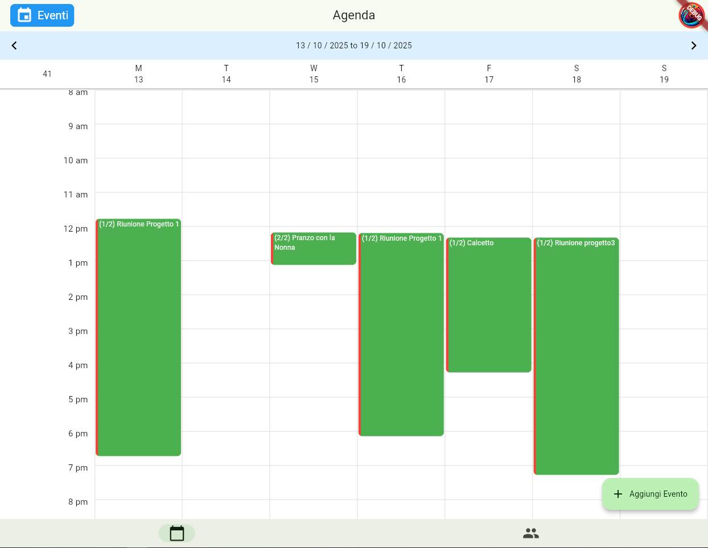

# WYD – Frontend
### Everything is an event.

Wyd is a cross‑platform application built with Flutter that transforms the way people organize and live events. Its genius lies in bringing everything into one place: both the events you’ve already confirmed and the invitations you’re still considering. No more juggling between chats, calendars, and social feeds — Wyd centralizes it all.

And it doesn’t stop there. Once an event is over, Wyd automatically looks for photos taken during that time frame, helping you relive and share memories without lifting a finger.

  
  

## 🚀 Why Wyd Matters
- One app, all events: Confirmed commitments and pending invitations coexist seamlessly in a single interface.

- Clarity over chaos: Avoid double bookings, missed opportunities, and last‑minute cancellations.

- Effortless memories: After each event, Wyd automatically gathers your photos from that timeframe, so the story of your experience is preserved.

 - Designed for real life: From casual coffee meetups to concerts and conventions, Wyd adapts to both personal and professional needs.

## 📸 Key Features
- Unified calendar with both confirmed events and pending invitations

- Automatic migration of events from “proposed” to “confirmed” once accepted

- Real‑time updates across all participants

- Automatic photo retrieval after events, creating a shared memory archive

- Cross‑platform experience powered by Flutter (iOS, Android, Web)

- Cloud‑backed scalability
